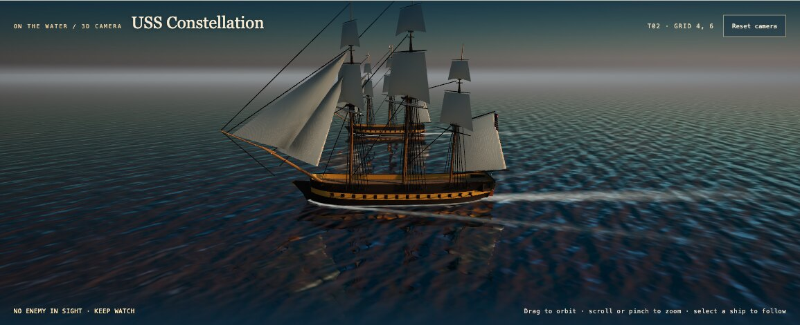
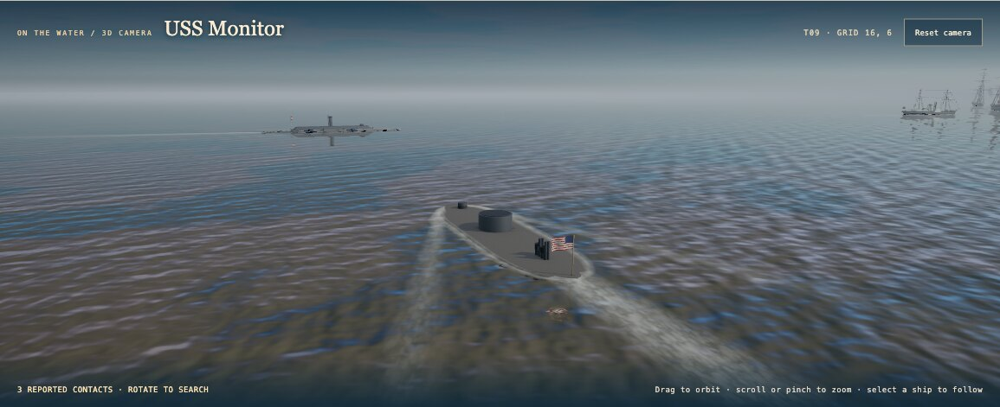
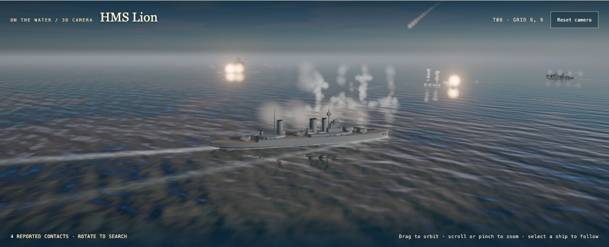
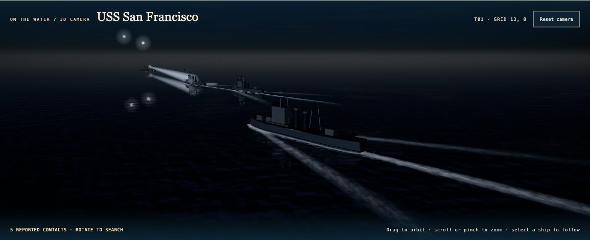
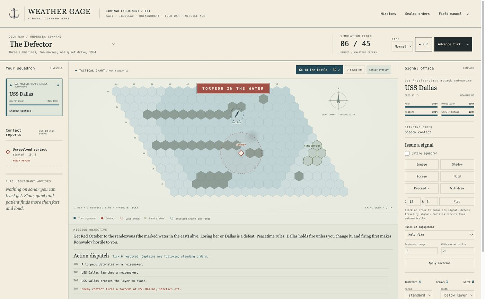

# Weather Gage



A browser-first naval command game. **You command the squadron:** issue orders, work from imperfect contact reports, and let your captains fight the engagement—or **Take Command** of one sail or dreadnought vessel for deliberate next-turn helm and weapon decisions. It spans frigates under sail, ironclads, dreadnoughts, a radar-lit night action, Cold War submarines and near-future missiles, all on one simulation.

**Status:** a playable research build, not a finished naval simulator. Single player, nine scenarios. Each has a paper-and-ink tactical chart and an orbitable 3D battle camera with authored ship models. Combat and balance values are game abstractions. No accounts, telemetry, external fonts or remote services.

| | |
|---|---|
|  |  |
| **Iron at Hampton Roads, 1862.** The Monitor arrives to meet CSS Virginia. | **Smoke over the Dogger Bank, 1915.** Lion's battlecruisers trade salvos with the German raiders. |
|  |  |
| **Night off Cape Esperance, 1942.** Radar against trained night lookouts, starshell and the Long Lance. | **The chart room.** Orders travel by signal; contacts are only as good as your sensors. |

## Play locally

Requires **Node.js 22.12+**. Install the pinned dependencies (Three.js and Vite) first.

```sh
git clone https://github.com/eforbell/weather-gage.git
cd weather-gage
npm ci
npm run dev
```

Open **http://127.0.0.1:4173**. The development server binds only to your computer. Use `npm run build` to create self-contained static files in `dist/`; `npm run preview` serves that build locally. Opening `index.html` with `file://` will not work with ES modules.

1. Pick a mission in the **chart room** (the **Missions** button reopens it), read the sealed orders, and return to the chart.
2. Select a ship in **Your squadron**. Check **Entire squadron** to address the group.
3. Issue **Engage**, **Form line**, **Screen**, **Hold**, **Proceed**, or **Withdraw**.
4. For **Proceed**, click a sea hex or enter Q/R coordinates and choose **Plot**.
5. **Advance tick** resolves one step; **Run** starts a pauseable clock at the chosen **Pace**. New contacts pause it automatically. Movement, gunfire, hits, torpedoes and sinkings play out on the chart; **Sound** toggles synthesized ambience and effects.
6. Choose **Go to the battle · 3D** above the chart for an orbitable ship view. Drag to orbit, scroll or pinch to zoom, and select a ship in the roster to follow it. Orders and the clock still work; use **Return to chart** for exact hex plotting. Surface cameras do not show submerged boats; underwater cameras show only the selected boat and nearby friendlies at the same depth. Cold War sonar contacts stay in the chart/list because their depth is not reported. If WebGL is unavailable, the chart remains playable.
7. Adjust engagement range, hold-fire doctrine and withdrawal threshold. In the WWII and modern scenarios, decide when to radiate radar.
8. In **The Northern Screen**, select the carrier to launch a limited patrol flight toward a Q/R sector. Its report arrives two ticks later on the carrier’s picture, not on every submarine’s sonar.
9. Review the dispatch at mission end. **New sortie** restarts; the mission selector switches eras. Both start a fresh game, so save/export first if you want to keep the current sortie.

Keyboard: **Space** run/pause, **N** advance, outside form controls. Native controls work with Tab/Enter. The coordinate inputs are the keyboard alternative to map clicking.

### Take Command — sail and dreadnoughts

Select an operational vessel at Nevis, The Line of Battle, or Dogger Bank, then choose **Take Command**. The clock pauses and the captain's station replaces that vessel's signal controls:

1. Choose **Hold station**, **Port** (left), **Starboard** (right), or **Ahead**.
2. Designate a reported contact and choose whether to hold weapons, fire guns, or release dreadnought torpedoes where available.
3. Read the **XO's assessment** and nearby readiness explanations. These are forecasts, not guarantees: wind, contacts and traffic can change during the turn.
4. Choose **Resolve captain's turn** or **Advance tick**. Your plan resolves once, with everyone else's normal actions. Then choose the next plan. Other vessels continue on doctrine; automatic running is disabled until you return to the flag.

No turret aiming, precision trigger timing, or bonus actions. Gun arcs, readiness, rules of engagement and ammunition still matter. **Return to flag** resumes the preserved standing order; entering command clears that vessel's queued signals. Selecting another vessel does not transfer command automatically. Group signals address the other vessels.

The station also works alongside the 3D camera, with compact controls in full screen. Saves retain your staged plan and resume paused. Outside Take Command, **Captain's report** explains the selected vessel's standing order and its main known constraint in plain language. Shot types and other eras are not part of this first slice. See the [Take Command plan](docs/design/take-command-plan.md) for scope, acceptance criteria and follow-on decisions.

## Six eras, one simulation

- **Weather Gage off Nevis:** sail movement affected by wind, facing and broadside arcs, signal delay, four damage tracks, autonomous captains. Inspired by history, not a reconstruction of the 1799 duel.
- **Iron at Hampton Roads (1862):** CSS Virginia and two gunboats against the wooden blockade: Cumberland and Congress at anchor, Minnesota under steam. An unknown contact arrives mid-action. Armour against shell, the ram (beam-on or glancing), fires aboard wooden ships, deep draught barred by shoals, raking anchored ships, flag signals slowed by gun smoke, simultaneous fire. Inspired by the 1862 battle, with both days compressed into one sortie.
- **Smoke over the Dogger Bank (1915):** a battlecruiser, a battleship and two destroyers against a German raiding force. Speed classes, turret arcs (cross the T), fire-control ranging, armour, torpedo attacks, wireless that gives away your flagship, smoke that blinds gunlayers firing downwind, declared minefields. Inspired by Dogger Bank, not a reconstruction. See [the era extension report](docs/era-extension.md).
- **Night off Cape Esperance (1942):** US cruisers with radar against a Japanese bombardment group coming down the Slot in the dark. Search radar sees but cannot name; warning receivers hear only the bands they cover; trained night lookouts, gun flashes, starshell and searchlights; radar-directed against visual gunnery; the 8-mile Long Lance torpedo. Japan wins by getting two cruisers to the bombardment line off Lunga Point. Inspired by the battle, not a reconstruction. See [the WWII design notes](docs/design/ww2-radar-night-action.md).
- **The Defector (1984):** a fan scenario inspired by *The Hunt for Red October*. You command USS Dallas; Red October (a third party, neither friend nor foe) runs a seabed canyon toward a rendezvous while the Alfa-class Konovalov hunts her. Passive sonar with uncertainty rings, the baffles and Crazy Ivans, the thermal layer, one ping only (which can put the defector under your command), torpedoes that seek the loudest boat, friend or foe, and can fail to arm, noisemakers, peacetime rules of engagement, and scripted sabotage and surfacing.
- **The Northern Screen (1986):** a fictional carrier escort on a larger 30×18 chart. Two ASW destroyers and two attack submarines screen a light carrier against three hostile boats. Surface escorts can ping and fire limited ASW torpedoes; the carrier launches four delayed patrol flights. Every vessel retains its own contact picture. Get the carrier to the eastern rendezvous before she is lost or time runs out.
- **The Strait of Qamar:** fictional near-future surface action, active radar and passive detection, emission tradeoffs, finite missile magazines, delayed missile impacts and defensive interceptors.

All scenarios have fog-of-war reports, last-known contacts, doctrine, terrain, deterministic seeded randomness and a mission debrief. Turn-stepping and real-time presentation call the same fixed-tick engine.

## Save and resume

**Save locally** stores one sortie in this browser, at this exact origin. **Load save** resumes it paused. **Export / Import** moves a versioned JSON save between browsers. Browser storage can be unavailable or cleared; exports are the portable backup. Saves contain complete simulation state, including enemy information; this is not an anti-cheat boundary.

## Ships are generated, not hand-modelled

The authored hulls (the Nevis frigates, all of Hampton Roads, and the Dogger Bank fleets) are built from JSON specs in metres by a headless Blender pipeline. An agent or a person edits numbers (offsets tables, turrets, gunports, masts and sails, paddle wheels), looks at the review renders, and repeats. A report checks every model against its spec, and the tests check every model against its scenario. See [the ship pipeline](docs/ship-pipeline.md); each ship's `PROVENANCE.md` records what is fact and what is a deliberate choice.

```sh
npm run ship:build -- uss-constellation   # Blender 5.2 LTS, about 2 s per ship
```

## Verify

```sh
npm test       # Node's built-in regression tests
npm run check  # syntax/static parsing of all source, tests and scripts
npm run build  # bundle the 3D renderer for static hosting
```

No TypeScript compiler/linter package is installed. `check` is a syntax check, not a claim of comprehensive lint coverage. See [the 3D prototype notes](docs/3d-prototype.md) for scope, costs, and known gaps.

## Repository map

```text
src/sim/engine.js       Pure simulation, player views, commands, saves, fx events
src/sim/core.js         Shared rule primitives: hex math, seeded RNG, damage, dispatches, fx
src/sim/eras/           Era rule modules (registry): ironclad, dreadnought, ww2, coldwar, shared steam movement and route finding
src/sim/scenarios.js    Scenario metadata, ship configurations, maps
src/ui/app.js           Browser controls, SVG chart and dialogs
src/ui/battle-presentation.js  Fog-safe actors from the selected ship's player view
src/ui/battle-3d.js    Optional Three.js camera, sea, lighting, and combat effects
src/ui/battle-models.js  Procedural 3D ship models (stand-ins and uncertain contacts)
src/ui/ship-assets.js    Registry of authored ship models, scaled per era
ships/                  Ship specs (metres) and provenance for the authored models
tools/blender/          Headless Blender kit that builds ships/ into public/assets/ships/
src/ui/fx.js            Combat animation and synthesized sound (presentation only)
src/ui/advisor.js       Flag lieutenant advice, tactics primer, debrief lessons
src/ui/style.css        Paper-and-ink visual system, responsive layout
scripts/serve.mjs       Legacy dependency-free server retained for server tests
scripts/check.mjs      Dependency-free JavaScript syntax checks
tests/                 Simulation regression tests
reference/             Original concept/prototype exports, preserved
DESIGN.md              Product and interface design contract
docs/                  Review, architecture, roadmap, backlog, validation
```

## Why a browser?

It offers a low-friction way to play on desktop operating systems and share a static deployment, while the DOM-free simulation remains portable to a future desktop shell. The tactical chart remains SVG; the GPU renderer is lazy-loaded only when the player enters the 3D camera.

The original scaffold was dependency-free. The 3D experiment follows the [official Three.js installation approach](https://threejs.org/manual/pages/installation.html) with Vite, retaining the pure simulation and ordinary static deployment. Local saves are best-effort browser storage ([MDN Web Storage](https://developer.mozilla.org/en-US/docs/Web/API/Web_Storage_API/Using_the_Web_Storage_API)).

## What's deliberately not here yet?

Campaigns, fitting-out, Take Command for other eras, shot selection, historical balance, full line-of-sight/weather/signal obstruction, individually flown aircraft or air combat, multiplayer, desktop packaging, and carrier air power (designed in the WWII notes, not built). The era models remain deliberately small; a complete plug-in registry is a next step, not a claim of this scaffold.

See [concept review](docs/concept-review.md), [architecture](docs/architecture.md), [roadmap](docs/roadmap.md), and the [simulation improvement backlog](docs/backlog.md).
